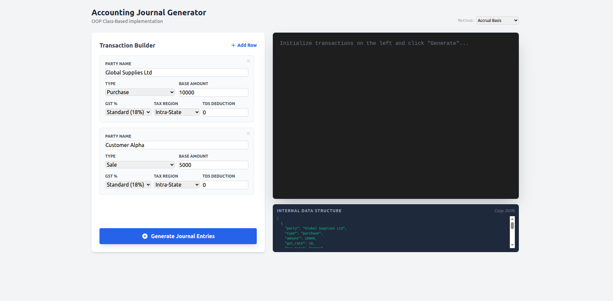

# Accounting Journal Entry Simulator

A **class-based JavaScript application** that simulates accounting journal entries for purchases, sales, debit notes, and credit notes with GST and TDS calculations. Built with **HTML, Tailwind CSS, and vanilla JS**.

---

## 🚀 Features

- Dynamic transaction form builder (Add/Remove rows)
- Supports **Purchase**, **Sale**, **Debit Note**, and **Credit Note**
- Automatically calculates **GST (CGST, SGST, IGST)** and **TDS**
- Supports **Accrual** and **Cash** accounting methods
- Real-time **JSON preview** of internal transaction data
- Terminal-like output to visualize journal entries
- Copy JSON structure to clipboard

---

## 🛠️ Technologies Used

- **HTML5**
- **JavaScript (ES6 Classes)**